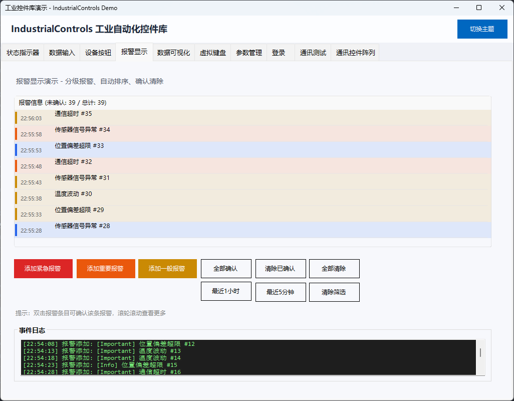
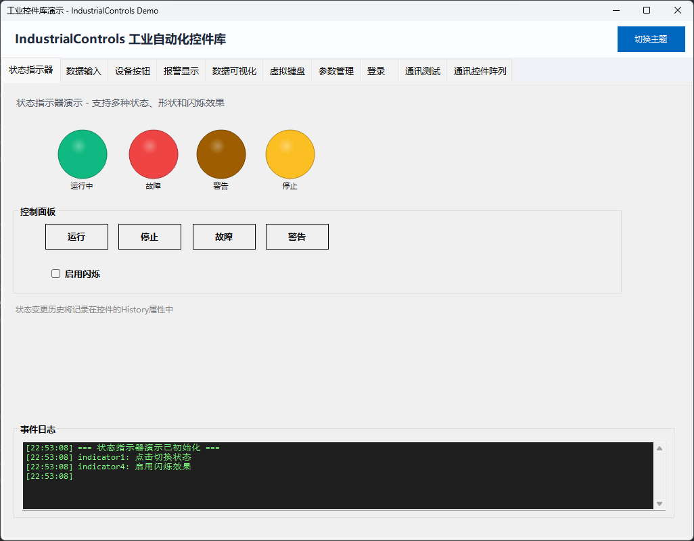
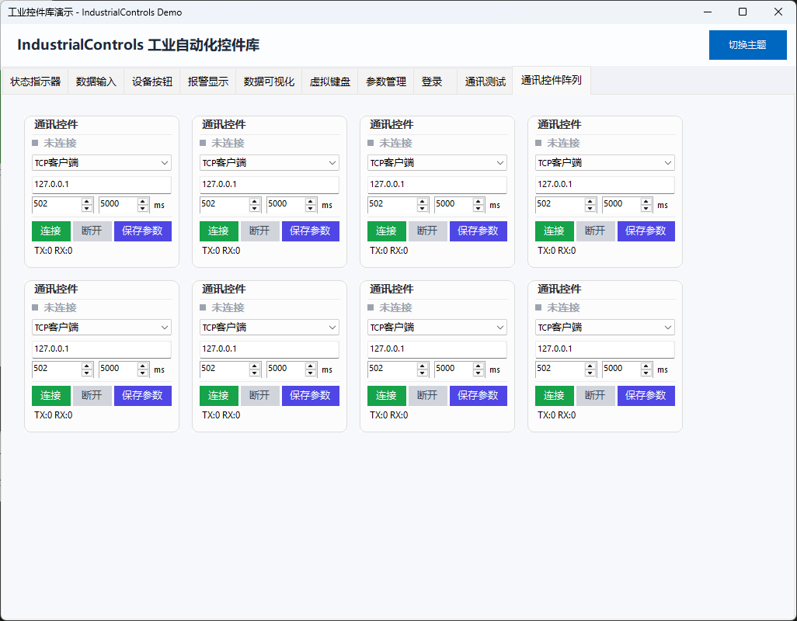
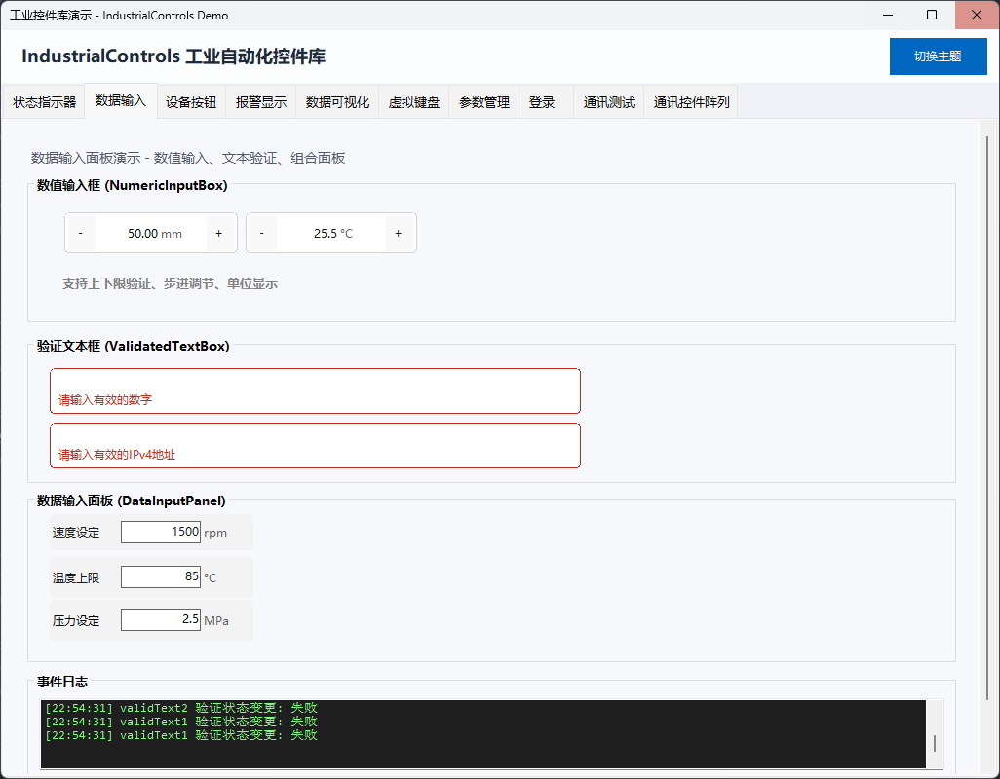
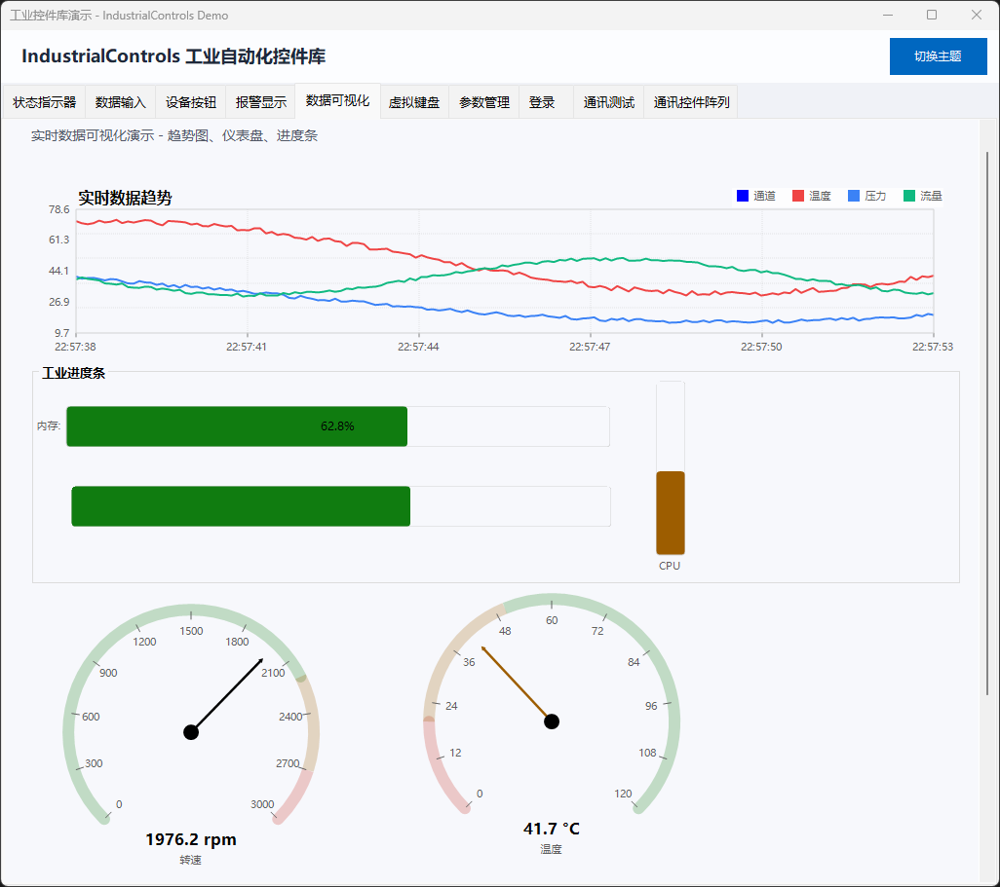
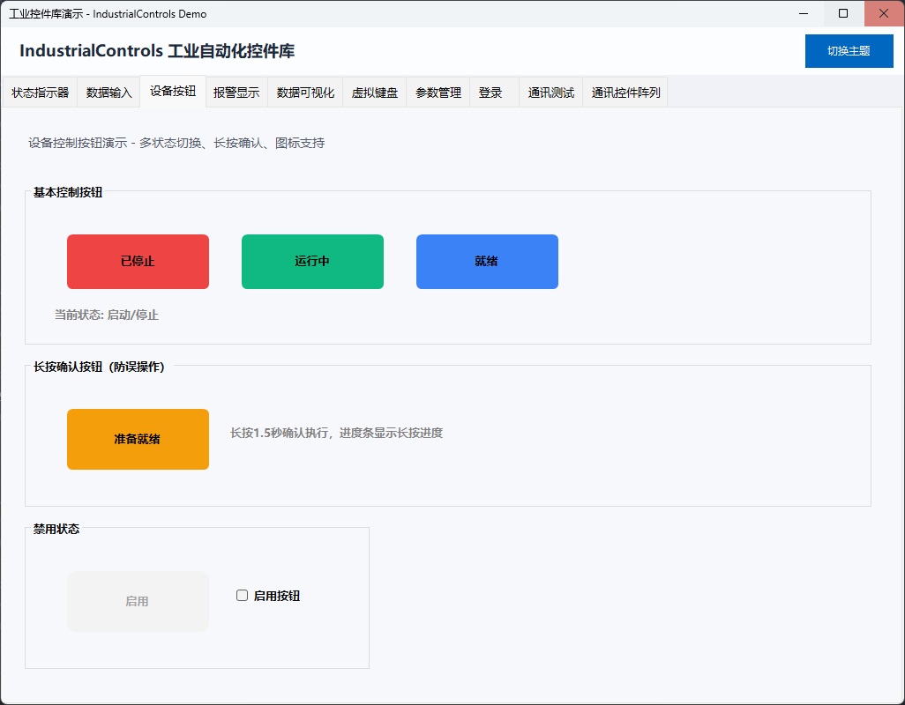
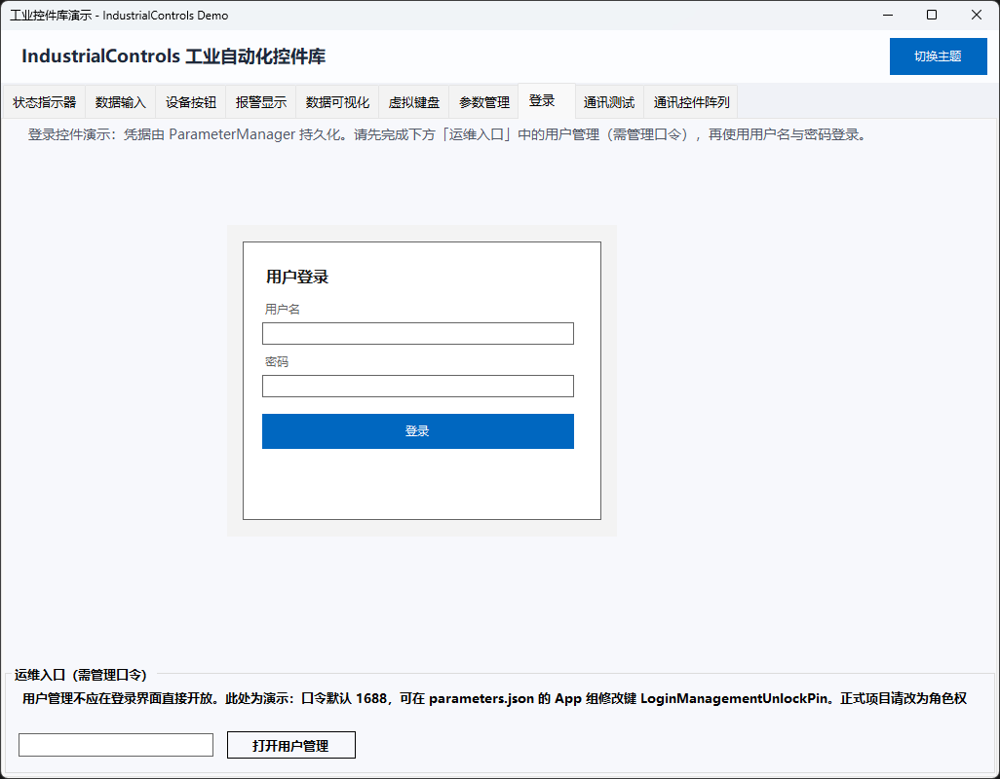
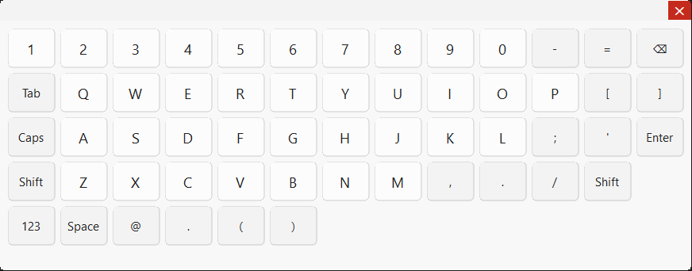

# 📚 IndustrialControls 控件库 API 使用手册

欢迎使用 IndustrialControls 控件库!本文档库提供了完整的API参考和使用指南。

## 📖 文档导航

### 🚀 快速开始

- **[API文档总览](docs/API-INDEX.md)** - 控件库概览、快速入门、典型应用场景

### 🔧 控件API文档

#### 核心基础设施
- **[ParameterManager - 参数管理系统](docs/ParameterManager-API.md)** - 配置文件管理、热更新、变更事件、多配置文件隔离

#### 报警与状态监控
- **[AlarmDisplay - 报警显示](docs/AlarmDisplay-API.md)** - 分级报警管理、自动排序、确认清除
- **[StatusIndicator - 状态指示器](docs/StatusIndicator-API.md)** - 多颜色状态、闪烁效果、历史记录





#### 通讯与数据交换
- **[CommunicationControl - 通讯控件](docs/CommunicationControl-API.md)** - TCP客户端/服务端/串口通讯



#### 数据输入与验证
- **[DataInput - 数据输入组件](docs/DataInput-API.md)**
  - NumericInputBox - 数值输入框
  - ValidatedTextBox - 验证文本框
  - DataInputPanel - 数据输入面板



#### 数据可视化
- **[TrendChart - 趋势图](docs/TrendChart-API.md)** - 多通道实时数据曲线显示



#### 设备控制
- **[DeviceControlButton - 设备控制按钮](docs/DeviceControlButton-API.md)** - 多状态切换、长按确认



#### 用户认证
- **[FlatLoginControl - 登录控件](docs/FlatLoginControl-API.md)** - 用户认证、参数持久化



#### 虚拟键盘
- **[VirtualKeyboard - 虚拟键盘系统](docs/VirtualKeyboard-API.md)**
  - VirtualKeyboardPanel - 键盘面板
  - VirtualKeyboardForm - 键盘窗体
  - VirtualKeyboardManager - 全局管理器



## 🎯 如何使用文档

### 1. 查找控件

通过 [API文档总览](docs/API-INDEX.md) 查找需要的控件,点击链接进入详细文档。

### 2. 学习使用

每个控件文档包含:
- ✅ **概述** - 控件功能简介
- ✅ **快速开始** - 最简使用示例
- ✅ **属性说明** - 所有公开属性详解
- ✅ **方法说明** - 所有公开方法详解
- ✅ **事件说明** - 所有可用事件详解
- ✅ **完整示例** - 实际应用场景代码
- ✅ **最佳实践** - 使用建议和注意事项

### 3. 参考示例

建议配合示例项目学习:
- `samples/IndustrialControls.Demo/` - 控件演示项目
- `samples/IndustrialControls.Template/` - 完整应用模板

## 📊 文档统计

| 类别 | 数量 |
|------|------|
| 控件API文档 | 8 |
| 总览文档 | 1 |
| 代码示例 | 50+ |
| 文档总行数 | 4500+ |

## 💡 学习路径

### 初学者
1. 阅读 [API文档总览](docs/API-INDEX.md)
2. 查看快速开始示例
3. 运行Demo项目

### 进阶使用
1. 深入学习各控件API
2. 参考完整示例代码
3. 阅读最佳实践

### 高级开发
1. 查看源码实现
2. 自定义控件扩展
3. 性能优化建议

## 🔍 搜索技巧

在文档中快速查找:
- **Ctrl+F** - 搜索关键字
- **Ctrl+Click** - 跳转链接
- 使用文档内的目录快速定位

## 📝 文档结构

每个控件文档遵循统一结构:

```
控件名称-API.md
├── 概述
├── 命名空间
├── 继承关系
├── 快速开始 (多个示例)
├── 属性 (详细列表)
├── 方法 (详细列表)
├── 事件 (详细列表)
├── 枚举类型
├── 关联类型
├── 完整示例 (实际场景)
├── 注意事项
├── 最佳实践
└── 相关控件
```

## 🛠️ 技术支持

- **项目路径**: `c:\Users\13626\Desktop\Winform上位机控件库`
- **源码位置**: `src\IndustrialControls\`
- **示例项目**: `samples\IndustrialControls.Demo\`

## 📅 更新记录

- **2026**: 初始版本,包含所有核心控件API文档

---

**祝您使用愉快!** 🎉

如有问题,请参考文档中的"注意事项"和"最佳实践"部分。
